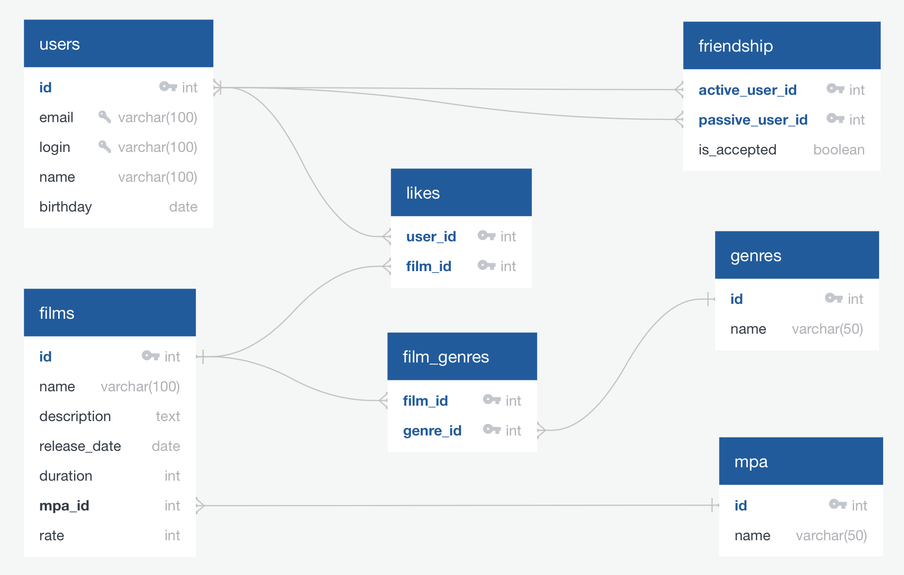

# Диаграмма БД:

- Основные сущности: __filmorate_user__ и __film__. Они связаны через таблицу __like__. Связи *'filmorate_user-like'* и *'film-like'* – один ко многим.
- Таблица для хранения пар пользователей (друзей) – __friendship__. Связь *'filmorate_user-friendship'* – два ко многим (многие ко многим).
- Таблицы __genre__ и __mpa__ – аналоги enam'а. Связи *'film-genre'* и *'film-mpa'* – многие к одному.



__*Примеры запросов*:__
1. *Выбрать [N] самых популярных фильмов.*
``` sql
SELECT f.name, COUNT(*) AS likes
  FROM Film AS f
  JOIN Like AS l ON f.id = l.film_id
  GROUP BY name
  ORDER BY likes DESC
  LIMIT [N];
```
2. *Вывести список общих друзей пользователей с [id1] и [id2].*
``` sql
(
    -- друзья пользователя [id1], которым он сам отправил заявку
  SELECT u2.name
    FROM filmorate_user AS u1
    JOIN friendship AS f1 ON u1.id = f1.active_user_id
    JOIN filmorate_user AS u2 ON u2.id = f1.passive_user_id
    WHERE u1.id = [id1] AND is_accepted = true

UNION

    -- друзья пользователя [id1], заявку от которых он подтвердил
  SELECT u2.name
    FROM filmorate_user AS u1
    JOIN friendship AS f1 ON u1.id = f1.passive_user_id
    JOIN filmorate_user AS u2 ON u2.id = f1.active_user_id
    WHERE u1.id = [id1] AND is_accepted = true
)

INTERSECT

(
    -- друзья пользователя [id2], которым он сам отправил заявку
  SELECT u2.name
    FROM filmorate_user AS u1
    JOIN friendship AS f1 ON u1.id = f1.active_user_id
    JOIN filmorate_user AS u2 ON u2.id = f1.passive_user_id
    WHERE u1.id = [id2] AND is_accepted = true

UNION

    -- друзья пользователя [id2], заявку от которых он подтвердил
  SELECT u2.name
    FROM filmorate_user AS u1
    JOIN friendship AS f1 ON u1.id = f1.passive_user_id
    JOIN filmorate_user AS u2 ON u2.id = f1.active_user_id
    WHERE u1.id = [id2] AND is_accepted = true
);
```
3. *Вывести статистику понравившихся пользователю [id1] фильмов по жанрам (количество).*
``` sql
SELECT g.name, COUNT(*) AS count
  FROM film AS f
  JOIN like AS l ON f.id = l.film_id
  JOIN filmorate_user AS u ON u.id = l.user_id
  JOIN genre AS g ON f.genre_id = g.id
  WHERE u.id = [id1]
  GROUP BY g.name
  ORDER BY count DESC;
```
4. *Вывести топ 10 самых популярных фильмов.*
``` sql
SELECT f.name
  FROM film AS f
  JOIN like AS l ON f.id = l.film_id
  GROUP BY f.name
  ORDER BY COUNT(*) DESC;
```
5. *Вывести только фильмы категории [mpa1]*
``` sql
SELECT f.name
  FROM film AS f
  JOIN mpa AS m ON f.mpa_id = m.id
  WHERE m.type = [mpa1];
```
